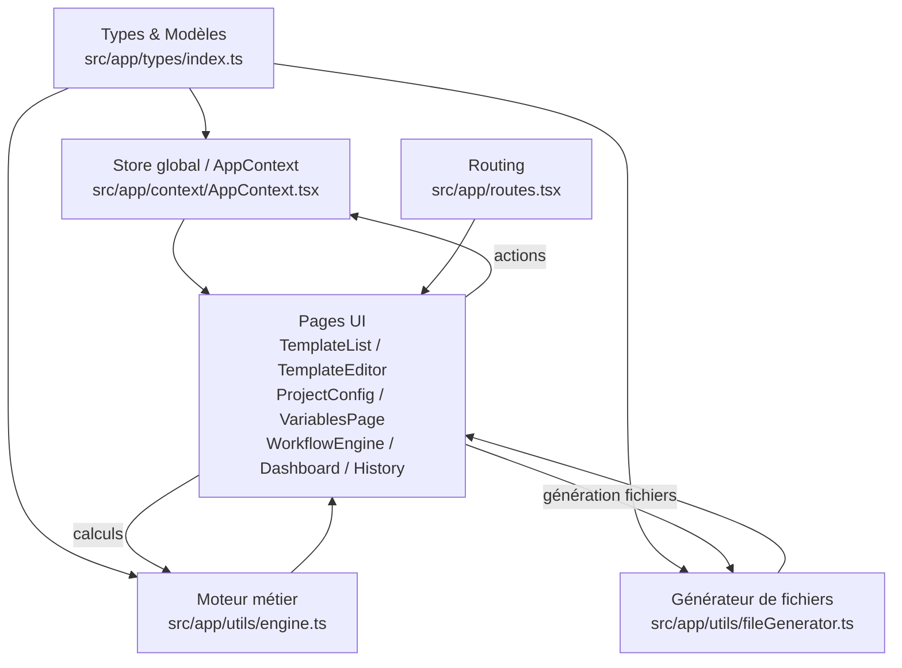

# Documentation technique — DocGen Pro

## 1. Architecture générale



**Séparation des responsabilités**
- **Types** : contrats de données partagés dans l’application.
- **Store global (AppContext)** : source de vérité des templates, types de projets, variables et historiques.
- **Moteur métier** : résolution de variables, activation conditionnelle et planification de génération.
- **Génération de fichiers** : conversion de contenus résolus en DOCX/XLSX/PDF/HTML.
- **Pages UI** : interaction utilisateur, validation, états vides, dialogs.
- **Routing** : configuration des routes et association composants.

## 2. Modèles de données

### `TemplateType`
- **Rôle** : enum des formats de templates gérés.
- **Valeurs** : `DOCX | XLSX | PDF | EMAIL`
- **Exemple** : `"DOCX"`

### `Template`
- **Rôle** : modèle de template de document/email.
- **Champs**
  - `id: string` — identifiant unique.
  - `name: string` — nom affiché.
  - `type: TemplateType` — format.
  - `projectTypeId: string | null` — type de projet associé ou aucun.
  - `content: string` — contenu du template (texte brut avec `{{variables}}`).
  - `variables: string[]` — liste des clés utilisées.
  - `linkedTemplateIds: string[]` — liens vers d’autres templates.
  - `status: 'draft' | 'published'` — état.
  - `updatedAt: string` — ISO date.
- **Exemple**
```ts
{
  id: "t_doc_1",
  name: "Contrat cadre v2",
  type: "DOCX",
  projectTypeId: "pt1",
  content: "Contrat pour {{nom_client}} — Type: {{type_projet}}",
  variables: ["nom_client", "type_projet"],
  linkedTemplateIds: [],
  status: "published",
  updatedAt: "2026-02-19T10:30:00.000Z"
}
```

### `ProjectOption`
- **Rôle** : option activable dans un type de projet.
- **Champs**
  - `id: string` — identifiant.
  - `label: string` — libellé utilisateur.
  - `subConfig?: Record<string, unknown>` — config additionnelle.
- **Exemple**
```ts
{ id: "opt_assurance", label: "Assurance annulation" }
```

### `PrerequisiteQuestion`
- **Rôle** : question préalable conditionnelle.
- **Champs**
  - `id: string`
  - `label: string`
  - `answerType: 'text' | 'yes-no' | 'dropdown' | 'number'`
  - `required: boolean`
  - `condition: { optionId: string } | null`
  - `dropdownOptions?: string[]`
- **Exemple**
```ts
{
  id: "q_assurance",
  label: "Avez-vous besoin de l'assurance annulation ?",
  answerType: "yes-no",
  required: true,
  condition: { optionId: "opt_assurance" }
}
```

### `DocumentRule`
- **Rôle** : règle de génération d’un fichier.
- **Champs**
  - `id: string`
  - `condition: { optionId: string } | null`
  - `templateId: string`
  - `outputPattern: string`
  - `destinationPath: string`
  - `active: boolean`
- **Exemple**
```ts
{
  id: "dr1",
  condition: null,
  templateId: "t_doc_1",
  outputPattern: "{{nom_client}}_{{type_projet}}_contrat",
  destinationPath: "/Projets/2026/Contrats",
  active: true
}
```

### `EmailRule`
- **Rôle** : règle de génération d’email (hérite de DocumentRule).
- **Champs supplémentaires**
  - `recipient: string` — destinataire résolu.
- **Exemple**
```ts
{
  id: "er1",
  condition: null,
  templateId: "t_email_1",
  outputPattern: "Email_Bienvenue_{{nom_client}}",
  destinationPath: "/Emails/2026",
  active: true,
  recipient: "{{contact_email}}"
}
```

### `ProjectType`
- **Rôle** : configuration complète d’un type de projet.
- **Champs**
  - `id, name, code, description, tags`
  - `options: ProjectOption[]`
  - `questions: PrerequisiteQuestion[]`
  - `documentRules: DocumentRule[]`
  - `emailRules: EmailRule[]`
  - `status: 'draft' | 'published'`
- **Exemple** (extrait)
```ts
{
  id: "pt1",
  name: "Produit A — Premium",
  code: "PROD_A_PREM",
  status: "published",
  options: [{ id: "opt_assurance", label: "Assurance annulation" }],
  questions: [{ id: "q_start", label: "Date de début souhaitée", answerType: "text", required: true, condition: null }]
}
```

### `GeneratedFile`
- **Rôle** : résultat de planification de génération.
- **Champs**
  - `name: string` — nom final (avec extension).
  - `type: TemplateType`
  - `templateId: string`
  - `destinationPath: string`
- **Exemple**
```ts
{
  name: "TechSolutions_ProduitA_Contrat.docx",
  type: "DOCX",
  templateId: "t_doc_1",
  destinationPath: "/Projets/2026/Contrats"
}
```

### `GenerationRecord`
- **Rôle** : historique d’une génération.
- **Champs**
  - `id: string`
  - `date: string` (ISO)
  - `clientName: string`
  - `clientNumber: string`
  - `projectTypeId: string`
  - `filesGenerated: GeneratedFile[]`
  - `status: 'success' | 'error'`
- **Exemple**
```ts
{
  id: "gr1",
  date: "2026-02-19T14:30:00.000Z",
  clientName: "TechSolutions SAS",
  clientNumber: "C-2026-042",
  projectTypeId: "pt1",
  status: "success",
  filesGenerated: [
    { name: "TechSolutions_ProduitA_Contrat.docx", type: "DOCX", templateId: "t_doc_1", destinationPath: "/Projets/2026/Contrats" }
  ]
}
```

## 3. Store global — AppContext

### `useApp()`
Retourne l’API du store global.

#### Propriétés
- `templates: Template[]`
- `projectTypes: ProjectType[]`
- `variables: Record<string, string>`
- `records: GenerationRecord[]`

#### Méthodes
- `addTemplate(template: Omit<Template, 'id' | 'updatedAt'>): void`
  - **Effet** : ajoute un template avec `id` et `updatedAt` générés.
  - **Exemple**
```ts
addTemplate({
  name: "Contrat de prestation",
  type: "DOCX",
  projectTypeId: "pt1",
  content: "Contrat {{nom_client}}",
  variables: ["nom_client"],
  linkedTemplateIds: [],
  status: "draft"
});
```

- `updateTemplate(id: string, updates: Partial<Template>): void`
  - **Effet** : met à jour et rafraîchit `updatedAt`.
  - **Exemple**
```ts
updateTemplate("t_doc_1", { status: "published" });
```

- `deleteTemplate(id: string): void`
  - **Effet** : supprime le template.

- `duplicateTemplate(id: string): void`
  - **Effet** : duplique un template, ajoute "(copie)", status `draft`.

- `addProjectType(projectType: Omit<ProjectType, 'id'>): void`
  - **Effet** : ajoute un type de projet avec `id` généré.

- `updateProjectType(id: string, updates: Partial<ProjectType>): void`
  - **Effet** : met à jour un type de projet.

- `deleteProjectType(id: string): void`
  - **Effet** : supprime un type de projet.

- `publishProjectType(id: string): void`
  - **Effet** : passe un type en `published`.

- `addVariable(key: string, label: string): void`
  - **Effet** : ajoute/écrase une variable (clé → libellé).

- `updateVariable(key: string, label: string): void`
  - **Effet** : met à jour le libellé.

- `deleteVariable(key: string): void`
  - **Effet** : supprime une variable.

- `addRecord(record: Omit<GenerationRecord, 'id' | 'date'>): void`
  - **Effet** : ajoute un historique avec `id` et `date` générés.

- `getRecords(): GenerationRecord[]`
  - **Effet** : retourne les historiques (ordre de stockage actuel).

## 4. Moteur métier — engine.ts

### `resolveVariables(template: string, values: Record<string, string>): string`
- **Rôle** : remplace `{{clé}}` par la valeur correspondante.
- **Paramètres**
  - `template` : texte avec placeholders.
  - `values` : dictionnaire clé → valeur.
- **Retour** : texte résolu.
- **Cas limites** : si la clé n’existe pas, le placeholder est conservé.
- **Exemple**
```ts
resolveVariables("Bonjour {{nom_client}}", { nom_client: "Dupont" });
// "Bonjour Dupont"
```

### `resolveOutputFileName(pattern: string, values: Record<string, string>): string`
- **Rôle** : résout un pattern et nettoie le nom de fichier.
- **Nettoyage** : retire `\\ / : * ? " < > |` et remplace espaces par `_`.
- **Exemple**
```ts
resolveOutputFileName("{{nom_client}} / Contrat", { nom_client: "ACME" });
// "ACME_Contrat"
```

### `getActiveQuestions(questions, selectedOptionIds): PrerequisiteQuestion[]`
- **Rôle** : filtre les questions selon les options sélectionnées.
- **Retour** : questions sans condition ou condition satisfaite.

### `getActiveDocumentRules(rules, selectedOptionIds): DocumentRule[]`
- **Rôle** : règles actives, filtrées par conditions et `active: true`.

### `getActiveEmailRules(rules, selectedOptionIds): EmailRule[]`
- **Rôle** : identique aux documents, pour emails.

### `buildGenerationPlan(projectType, selectedOptionIds, clientValues, templates): GeneratedFile[]`
- **Rôle** : construit la liste finale des fichiers à générer.
- **Process**
  - Récupère les règles actives.
  - Résout `outputPattern` → nom final avec extension.
  - Résout `destinationPath`.
- **Cas limites** : ignore les règles dont le template est introuvable.
- **Exemple**
```ts
buildGenerationPlan(pt1, ["opt_assurance"], values, templates);
// [{ name: "Client_Contrat.docx", type: "DOCX", ... }, ...]
```

## 5. Générateur de fichiers — fileGenerator.ts

### Signature
```ts
async function generateFile(template: Template, values: Record<string, string>): Promise<Blob>
```

### DOCX
- **Librairies** : `docxtemplater` + `pizzip`.
- **Principe** : création d’un zip DOCX minimal avec `document.xml` généré à partir du texte.
- **Résolution** : `docxtemplater` injecte les valeurs dans `{{ }}`.

### XLSX
- **Librairie** : `exceljs`.
- **Principe** : classeur avec feuille `Données` listant `clé / valeur`.

### PDF
- **Librairie** : `pdfmake`.
- **Principe** : document simple avec le contenu résolu en texte.

### EMAIL
- **Principe** : `Blob` `text/html` contenant le contenu résolu.

### Gestion des erreurs
- `generatePdf` renvoie une Promise rejetée en cas d’erreur.
- `generateFile` propage l’erreur, la page gère l’affichage (inline dans le wizard).

## 6. Routing

| Chemin | Composant | Description | Paramètres |
|---|---|---|---|
| `/` | `DashboardLayout` + `Dashboard` | Tableau de bord | — |
| `/templates` | `TemplateList` | Liste des templates | — |
| `/templates/new` | `TemplateEditor` | Création d’un template | — |
| `/templates/:id` | `TemplateEditor` | Édition d’un template | `id` |
| `/configuration` | `ProjectConfig` | Gestion des types de projets | — |
| `/variables` | `VariablesPage` | Dictionnaire de variables | — |
| `/workflow` | `WorkflowEngine` | Assistant de génération | — |
| `/history` | `HistoryPage` | Historique des générations | — |
| `/settings` | `SettingsPage` | Paramètres (placeholder) | — |
| `*` | Inline | Page non trouvée | — |

## 7. Composants clés — description par page

### `Dashboard`
- **Rôle** : vue synthétique des stats et actions rapides.
- **State local** : aucun.
- **Store** : `templates`, `projectTypes`, `getRecords()`.
- **Comportements** : stats dynamiques, activité récente, navigation rapide.

### `TemplateList`
- **Rôle** : recherche, filtre, duplication, suppression, aperçu.
- **State local** : `searchTerm`, `typeFilter`, `previewTemplate`.
- **Store** : `templates`, `variables`, `duplicateTemplate`, `deleteTemplate`.
- **Moteur** : `resolveVariables` (aperçu).
- **Dialogs** : confirmation suppression, aperçu.

### `TemplateEditor`
- **Rôle** : création/édition d’un template.
- **State local** : `form`, `errors`, `previewOpen`.
- **Store** : `templates`, `projectTypes`, `variables`, `addTemplate`, `updateTemplate`.
- **Moteur** : `resolveVariables` (aperçu), extraction variables via regex.
- **Comportements** : insertion de variable au curseur, validation, mode création/édition.

### `ProjectConfig`
- **Rôle** : gestion types de projets + éditeur latéral.
- **State local** : `editorMode`, `form`, `errors`, `simulateOpen`, `simulateOptionIds`.
- **Store** : `projectTypes`, `templates`, CRUD + publication.
- **Moteur** : `getActiveQuestions`, `getActiveDocumentRules` (simulation).
- **Comportements** : validation unicité code, options/questions/règles dynamiques.

### `VariablesPage`
- **Rôle** : dictionnaire des variables.
- **State local** : recherche, ajout, édition inline.
- **Store** : `variables`, `addVariable`, `updateVariable`, `deleteVariable`.
- **Comportements** : clés système protégées, validation unicité insensible à la casse.

### `WorkflowEngine`
- **Rôle** : assistant de génération en 5 étapes.
- **State local** : `WizardState`, `step`, `isGenerating`, `generationError`.
- **Store** : `projectTypes`, `templates`, `addRecord`.
- **Moteur** : `getActiveQuestions`, `buildGenerationPlan`.
- **Génération** : `generateFile` (DOCX/XLSX/PDF/EMAIL) + téléchargement.
- **Comportements** : préremplissage via `location.state.prefill`.

### `HistoryPage`
- **Rôle** : historique, filtres, détails, export CSV.
- **State local** : filtres, pagination, `selectedRecord`.
- **Store** : `getRecords`, `projectTypes`.
- **Comportements** : tri par date décroissante, export CSV avec BOM.

## 8. Dépendances npm

| Package | Version | Rôle |
|---|---|---|
| `@emotion/react` | 11.14.0 | Styling (MUI) |
| `@emotion/styled` | 11.14.1 | Styling (MUI) |
| `@mui/icons-material` | 7.3.5 | Icônes MUI |
| `@mui/material` | 7.3.5 | UI MUI |
| `@popperjs/core` | 2.11.8 | Positionnement tooltip/popover |
| `@radix-ui/react-accordion` | 1.2.3 | UI primitives |
| `@radix-ui/react-alert-dialog` | 1.1.6 | Dialogs de confirmation |
| `@radix-ui/react-aspect-ratio` | 1.1.2 | Layout |
| `@radix-ui/react-avatar` | 1.1.3 | UI |
| `@radix-ui/react-checkbox` | 1.1.4 | UI |
| `@radix-ui/react-collapsible` | 1.1.3 | UI |
| `@radix-ui/react-context-menu` | 2.2.6 | UI |
| `@radix-ui/react-dialog` | 1.1.6 | Modales |
| `@radix-ui/react-dropdown-menu` | 2.1.6 | Menus |
| `@radix-ui/react-hover-card` | 1.1.6 | UI |
| `@radix-ui/react-label` | 2.1.2 | UI |
| `@radix-ui/react-menubar` | 1.1.6 | UI |
| `@radix-ui/react-navigation-menu` | 1.2.5 | UI |
| `@radix-ui/react-popover` | 1.1.6 | UI |
| `@radix-ui/react-progress` | 1.1.2 | UI |
| `@radix-ui/react-radio-group` | 1.2.3 | UI |
| `@radix-ui/react-scroll-area` | 1.2.3 | UI |
| `@radix-ui/react-select` | 2.1.6 | UI |
| `@radix-ui/react-separator` | 1.1.2 | UI |
| `@radix-ui/react-slider` | 1.2.3 | UI |
| `@radix-ui/react-slot` | 1.1.2 | UI |
| `@radix-ui/react-switch` | 1.1.3 | UI |
| `@radix-ui/react-tabs` | 1.1.3 | UI |
| `@radix-ui/react-toggle` | 1.1.2 | UI |
| `@radix-ui/react-toggle-group` | 1.1.2 | UI |
| `@radix-ui/react-tooltip` | 1.1.8 | UI |
| `class-variance-authority` | 0.7.1 | Variants Tailwind |
| `clsx` | 2.1.1 | Utilitaire classes |
| `cmdk` | 1.1.1 | Command palette |
| `date-fns` | 3.6.0 | Dates |
| `docxtemplater` | ^3.68.2 | Génération DOCX |
| `embla-carousel-react` | 8.6.0 | Carousel |
| `exceljs` | ^4.4.0 | Génération XLSX |
| `framer-motion` | ^12.34.2 | Animations (non utilisé directement) |
| `input-otp` | 1.4.2 | UI |
| `lucide-react` | 0.487.0 | Icônes |
| `motion` | ^12.23.24 | Animations (utilisé via `motion/react`) |
| `next-themes` | 0.4.6 | Thèmes |
| `pdfmake` | ^0.3.4 | Génération PDF |
| `pizzip` | ^3.2.0 | Zip DOCX |
| `react-day-picker` | 8.10.1 | Date picker |
| `react-dnd` | 16.0.1 | Drag & drop |
| `react-dnd-html5-backend` | 16.0.1 | Backend DnD |
| `react-hook-form` | 7.55.0 | Forms |
| `react-popper` | 2.3.0 | Positionnement |
| `react-resizable-panels` | 2.1.7 | Layout |
| `react-responsive-masonry` | 2.7.1 | Layout |
| `react-router` | 7.13.0 | Routing |
| `react-slick` | 0.31.0 | Carousel |
| `recharts` | 2.15.2 | Graphiques |
| `sonner` | 2.0.3 | Toasts |
| `tailwind-merge` | 3.2.0 | Fusion classes |
| `tw-animate-css` | 1.3.8 | Animations |
| `vaul` | 1.1.2 | Drawer UI |
| `@types/pdfmake` | ^0.3.1 | Types TS PDFMake (dev) |
| `@tailwindcss/vite` | 4.1.12 | Tailwind + Vite (dev) |
| `@vitejs/plugin-react` | 4.7.0 | Vite React (dev) |
| `tailwindcss` | 4.1.12 | CSS framework (dev) |
| `vite` | 6.3.5 | Bundler (dev) |

## 9. Extensibilité

### Ajouter un nouveau type de fichier généré
1. Mettre à jour `TemplateType` dans `src/app/types/index.ts`.
2. Adapter `extensionByType` dans `src/app/utils/engine.ts`.
3. Ajouter le traitement dans `src/app/utils/fileGenerator.ts` (nouveau switch case).
4. Mettre à jour UI (badges, filtres) dans `TemplateList`, `WorkflowEngine`, `History` si nécessaire.

### Ajouter une nouvelle variable système
1. Ajouter la clé/label dans `INITIAL_VARIABLES` de `src/app/context/AppContext.tsx`.
2. Ajouter la clé dans la liste système de `src/app/pages/config/VariablesPage.tsx`.
3. (Optionnel) Utiliser la variable dans un template/regel.

### Ajouter un nouveau type de question prérequis
1. Étendre `PrerequisiteQuestion['answerType']` dans `src/app/types/index.ts`.
2. Mettre à jour l’UI dans `WorkflowEngine` (rendu du champ + validation).
3. Mettre à jour l’éditeur dans `ProjectConfig` (select + champs spécifiques).
4. (Optionnel) Adapter `getActiveQuestions` si la logique conditionnelle évolue.
```
